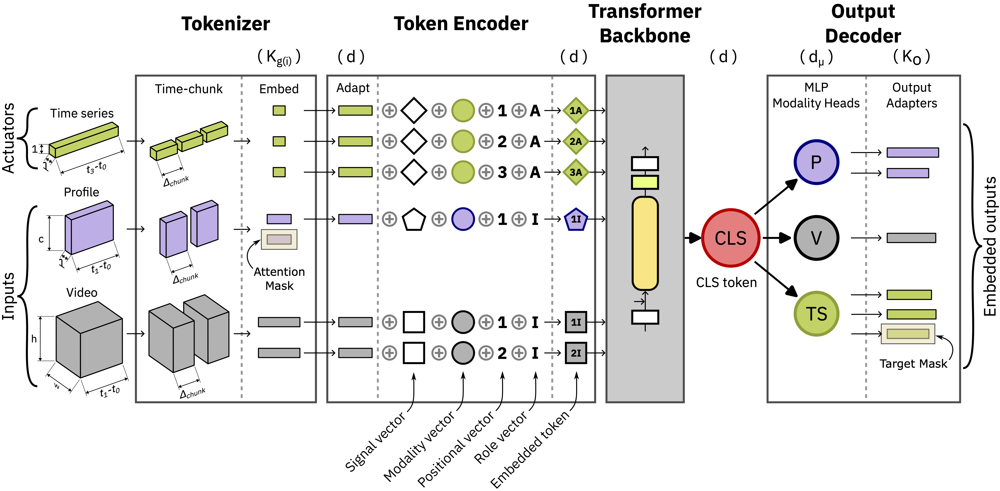

# TokaMind

TokaMind provides a multi-modal, token-based Transformer pipeline for scientific and industrial signals.

The repository is split into two layers:
- `src/mmt/`: dataset-agnostic core library (model, codecs, transforms, training loop) — usable standalone without any external dataset integration (see `src/mmt/examples/` for a self-contained toy example)
- `scripts_mast/`: FAIR/MAST integration layer (task configs, data wiring, entry scripts)

## 📝 Description
TokaMind implements a schema-flexible tokenization pipeline and a modular multi-modal Transformer with per-output adapters.

The code corresponds to the official implementation introduced in [TokaMind: A Multi-Modal Transformer Foundation Model for Tokamak Plasma Dynamics](https://arxiv.org/abs/2602.15084), evaluated against the [TokaMark benchmark](https://arxiv.org/abs/2602.10132).

[](assets/mmt_architecture.pdf)
*Figure: Tokenization + model flow.* Windowed multimodal inputs and actuators are chunked and compressed by signal-specific codecs into tokens. Tokens are projected to a shared model dimension, processed by a Transformer backbone, and mapped to targets via modality heads and per-output adapters.

## 🔗 Companion Resources

| Resource | Link |
|---|---|
| TokaMind paper | [arXiv:2602.15084](https://arxiv.org/abs/2602.15084) |
| TokaMark paper | [arXiv:2602.10132](https://arxiv.org/abs/2602.10132) |
| TokaMark repository | [UKAEA-IBM-STFC-Fusion-FMs/tokamark](https://github.com/UKAEA-IBM-STFC-Fusion-FMs/tokamark) |
| VAE-FAIRMAST repository | _coming soon_ |
| Pretrained model (HuggingFace) | [UKAEA-IBM-STFC/tokamind-base-v2](https://huggingface.co/UKAEA-IBM-STFC/tokamind-base-v2) |

## 📚 Documentation
- [Configuration Guide](docs/config_guide.md)
- [Configuration Reference](docs/config_reference.md)
- [Training](docs/training.md)
- [DCT3D Tuning](docs/tuning_dct3d.md)
- [Checkpointing and Warmstart](docs/checkpointing_and_warmstart.md)
- [Evaluation](docs/evaluation.md)
- [Datasets](docs/datasets.md)
- [Transforms](docs/transforms.md)
- [Model Architecture](docs/model_architecture.md)
- [Model Flexibility](docs/model_flexibility.md)

## 🗂️ Repository Layout
```text
.
├── src/mmt/                           # Core package (dataset-agnostic, usable standalone)
│   ├── data/                          # signal specs, codecs, transforms, datasets
│   ├── models/                        # transformer model blocks
│   ├── train/                         # training loop
│   ├── eval/                          # decode and eval helpers
│   ├── examples/                      # self-contained toy training example (no FAIR/MAST required)
│   └── utils/                         # logging, seeds, config validation
├── scripts_mast/                      # FAIR/MAST integration
│   ├── run_pretrain.py
│   ├── run_finetune.py
│   ├── run_eval.py
│   ├── mast_utils/
│   │   ├── config/                    # config loading modules
│   │   └── ...
    │   └── configs/
│       └── mmt/                        # self-contained model profile: phases/ tasks/ embeddings/
├── docs/                              # project documentation
└── runs/                              # output runs and checkpoints
```

## 📦 Installation

**Recommended Python: 3.11+**

For full MAST experiments, clone all repositories side-by-side in the same parent folder (steps 1–3 below). For standalone use, only step 1 is required.

Create and activate a conda environment first:

```bash
conda create -n tokamind-env python=3.14
conda activate tokamind-env
```

**For Windows users, install `wheels` and `setuptools`:**
```bash
pip install -U pip setuptools wheel
```

---

### 1) Install TokaMind

```bash
git clone https://github.com/UKAEA-IBM-STFC-Fusion-FMs/tokamind.git
cd tokamind
pip install -e .
```

> **Standalone use:** The core `src/mmt/` package works without any MAST/TokaMark integration. To verify your installation or explore the model independently, run the self-contained toy example:
> ```bash
> python src/mmt/examples/toy_train.py
> ```
> No benchmark data or external repositories required.

#### Developer setup (lint + format hooks)

For contributors, install dev dependencies and enable pre-commit hooks:

```bash
pip install -e ".[dev]"
pre-commit install
pre-commit run --all-files   # recommended once after setup
```

The pre-commit configuration runs `ruff check` and `ruff format`.

---

### 2) TokaMark integration

Required to run the MAST benchmark tasks via `scripts_mast/`.

```bash
git clone https://github.com/UKAEA-IBM-STFC-Fusion-FMs/tokamark.git
cd tokamark
pip install -e .
```

---

### 3) VAE-FAIRMAST integration (optional)

*Coming soon.* Only needed to reproduce the VAE embedding experiments for Group-1.

```bash
git clone <vae-fairmast-repo-url>   # coming soon
cd vae-fairmast
pip install -e .
```

---

## 🤗 Pretrained Model

Pretrained TokaMind checkpoints (trained on MAST data) are available on HuggingFace: [tokamind-base-v2](https://huggingface.co/UKAEA-IBM-STFC/tokamind-base-v2)

[//]: # (- [tokamind-tiny-v1]&#40;https://huggingface.co/UKAEA-IBM-STFC/tokamind/tree/main/tokamind-tiny-v1&#41;)

The HuggingFace repository includes:
- Model weights (`checkpoints/best`)
- Embedding artifacts (`embeddings/dct3d.yaml`, `embeddings/dct3d_indices/*.npy`)
- Config snapshot used for pretraining

To use it, download and place the model under `runs/` so it matches the expected layout:

```
runs/
└── tokamind-base-v2/
    ├── tokamind-base-v2.yaml
    ├── checkpoints/
    │   └── best
    └── embeddings/
        ├── dct3d.yaml
        └── dct3d_indices/
```

You can then warmstart a finetune directly from it — see [Checkpointing and Warmstart](docs/checkpointing_and_warmstart.md).

## 🚀 Run Workflow
### 1) Pretrain
```bash
python scripts_mast/run_pretrain.py \
  --task pretrain_inputs_actuators_to_inputs_outputs \
  --model_profile mmt \
  --emb_profile dct3d \
  --run-id tokamind_base
```

### 2) Finetune
**Warmstart:**
```bash
python scripts_mast/run_finetune.py \
  --task task_2-1 \
  --init warmstart \
  --model_profile mmt \
  --model_source tokamind_base \
  --emb_profile dct3d \
  --tag exp1
```

**Scratch:**
```bash
python scripts_mast/run_finetune.py \
  --task task_2-1 \
  --init scratch \
  --model_profile mmt \
  --emb_profile dct3d \
  --tag exp1
```

### 3) Evaluate
```bash
python scripts_mast/run_eval.py \
  --task task_2-1 \
  --model_source ft-task_2-1-ws-tokamind_base-exp1
```

## ⚙️ Configuration Model
Configuration is convention-based and merged by phase.

Each model profile is a self-contained folder holding `phases/`, `tasks/`, and `embeddings/`. Base phase files live under `phases/`:
- `scripts_mast/configs/mmt/phases/pretrain.yaml`
- `scripts_mast/configs/mmt/phases/finetune_warmstart.yaml`
- `scripts_mast/configs/mmt/phases/finetune_scratch.yaml`
- `scripts_mast/configs/mmt/phases/eval.yaml`

Embedding profiles live under the same model folder:
- `scripts_mast/configs/mmt/embeddings/dct3d/_default.yaml`
- `scripts_mast/configs/mmt/embeddings/vae/<task>.yaml` when a task has a VAE profile

Key data config knobs:
- `data.split`: `random` (default) or `temporal` — selects the shot split strategy for pretrain/finetune.
- `data.subset_size`: limits MAST shots.

Task runtime overrides are per model profile, under that profile's `tasks/` folder:
- `scripts_mast/configs/<model_profile>/tasks/pretrain_tasks.yaml`
- `scripts_mast/configs/<model_profile>/tasks/finetune_tasks.yaml`
- `scripts_mast/configs/<model_profile>/tasks/eval_tasks.yaml`

Finetune configs are split by model profile and init mode:
- `scripts_mast/configs/<model_profile>/phases/finetune_warmstart.yaml`: complete warmstart training recipe, `model_source`, and `model_overrides`
- `scripts_mast/configs/<model_profile>/phases/finetune_scratch.yaml`: complete scratch training recipe and complete `model_scratch`

Details are in:
- [Configuration Guide](docs/config_guide.md)
- [Configuration Reference](docs/config_reference.md)

## 🧩 Embedding Resolution
DCT3D tuning is integrated in the training scripts. Manual DCT3D overrides and tuning settings live under
`embeddings.dct3d` in `scripts_mast/configs/<model_profile>/embeddings/dct3d/_default.yaml`.
NaN/inf handling for both DCT3D tuning and runtime embedding is controlled by `preprocess.embed_chunks.nan_imputation`.

- Pretrain and scratch finetune tune DCT3D signals unless they have explicit manual per-signal overrides.
- Warmstart finetune inherits existing input/actuator artifacts from the source run, tunes new input/actuator signals,
  and tunes outputs. Manual per-signal overrides are left untouched.
- VAE profiles do not use DCT3D tune/source policy.
- Eval: embeddings are loaded from the evaluated training run.

Details are in [DCT3D Tuning](docs/tuning_dct3d.md).

## 📁 Outputs
Training runs are written under:
- `runs/<run_id>/`

Evaluation runs are written under:
- `runs/<model_id>/eval/`

Each training run stores:
- config snapshot (`<run_id>.yaml`)
- checkpoints (`checkpoints/best` and `checkpoints/latest`)
- embedding artifacts (`embeddings/dct3d.yaml`, `embeddings/dct3d_indices/*.npy` when rank mode is used)

See:
- [Checkpointing and Warmstart](docs/checkpointing_and_warmstart.md)
- [Evaluation](docs/evaluation.md)

## 📄 License
See [License file](LICENSE.md).

---

## Citing TokaMind

If you use TokaMind, please cite our work as:

    @article{boschi2026tokamind,
      title={TokaMind: A Multi-Modal Transformer Foundation Model for Tokamak Plasma Dynamics},
      author={
        Boschi, Tobia and Loreti, Andrea and Amorisco, Nicola C and Ordonez-Hurtado, Rodrigo H and
        Rousseau, C{\'e}cile and Holt, George K and Sz{\'e}kely, Eszter and Whittle, Alexander and
        Jackson, Samuel and Agnello, Adriano and Pamela, Stanislas and Pascale, Alessandra and
        Akers, Robert and Bernabe Moreno, Juan and Thorne, Sue and Zayats, Mykhaylo
      },
      journal={arXiv preprint arXiv:2602.15084},
      year={2026}
    }

If you use the TokaMark benchmark alongside TokaMind, please also cite:

    @article{rousseau2026tokamark,
      title={TokaMark: A Comprehensive Benchmark for MAST Tokamak Plasma Models},
      author={
        Rousseau, C{\'e}cile and Jackson, Samuel and Ordonez-Hurtado, Rodrigo H. and
        Amorisco, Nicola C. and Boschi, Tobia and Holt, George K and Loreti, Andrea and 
        Sz{\'e}kely, Eszter and Whittle, Alexander and Agnello, Adriano and Pamela, Stanislas and 
        Pascale, Alessandra and Akers, Robert and Bernabe Moreno, Juan and Thorne, Sue and 
        Zayats, Mykhaylo
      },
      journal={arXiv preprint arXiv:2602.10132},
      year={2026}
    }
